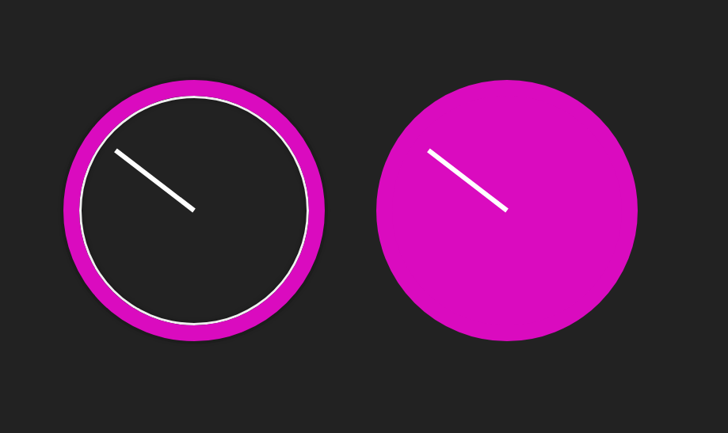

# midi-hsl
HSL colour changer knob for midi controller - You need a midi controller to see this working

Starting point was Natalya Shelburne's HSL clock http://artist-developer.com/demos.html from her colour theory for developer demos. Code can be found here: https://github.com/tallys

I've added the p5.midi javascript library https://github.com/therewasaguy/p5.midi despite not using p5.js yet.

I've replaced the date.getSeconds() value with the MIDI controllers 'knob position value' (there has to be a word for that - a number between 0 and 127) and adjusted the degrees from 60 seconds in one rotation, to 127 increments.
I offset it by 90 degrees so the digital visual representation matches the knob position of my physical controller.

I need to jiggle the knob to register its position before I start. I'm not sure how to get around this yet.
